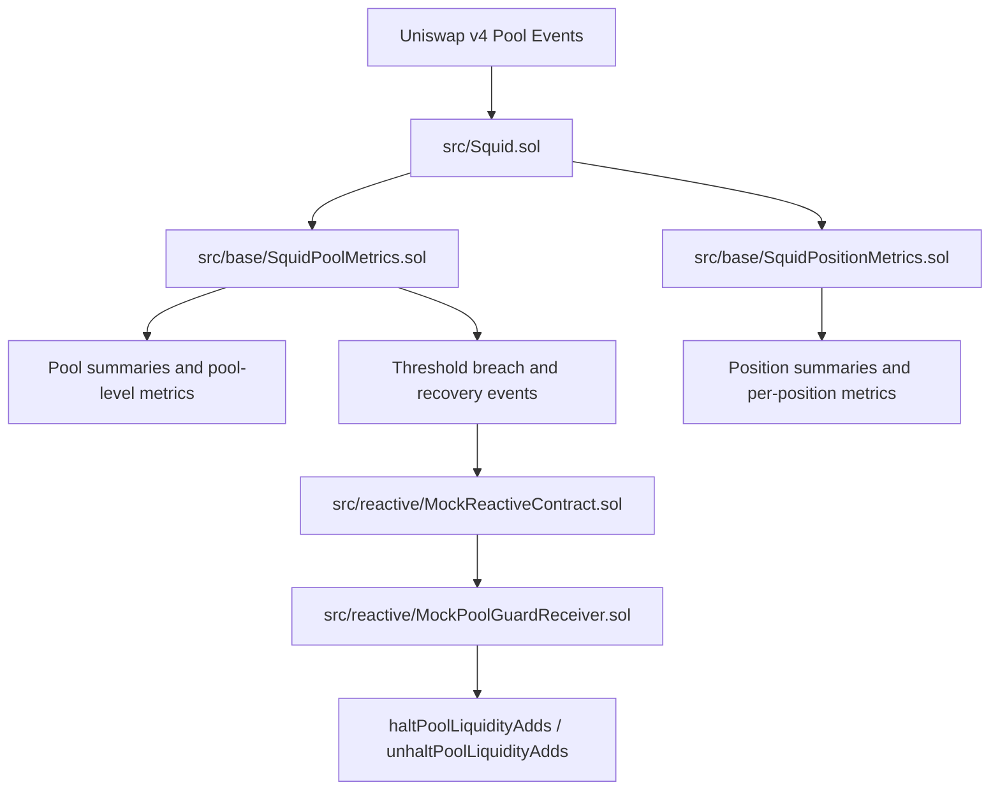
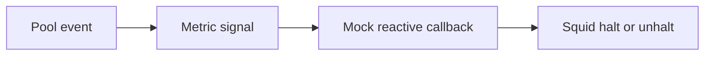
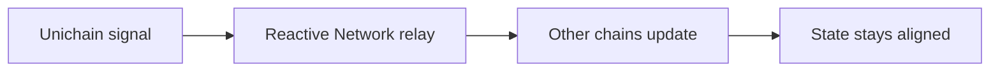
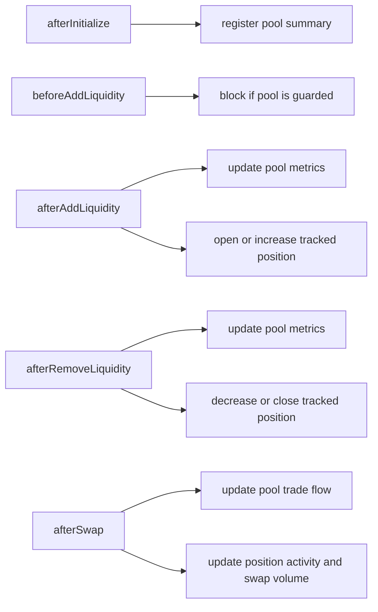

# Squid

Squid is a Uniswap v4 hook that records pool-level and position-level metrics as liquidity and swap activity flows through a pool. This repo also includes a deterministic Foundry simulation harness plus two dashboard apps for inspection.

This README is written for engineering review. It focuses on the Solidity system, the test and simulation surfaces, and the fastest path to understanding how the repo works.

## Index

- [Repository Layout](#repository-layout)
- [Fast Review Path](#fast-review-path)
- [System Overview](#system-overview)
- [Foundry Project](#foundry-project)
  - [Contract structure](#contract-structure)
  - [Hook lifecycle](#hook-lifecycle)
  - [Test structure](#test-structure)
  - [Test coverage map](#test-coverage-map)
  - [Script structure](#script-structure)
  - [Simulation flow](#simulation-flow)
- [Setup](#setup)
  - [1. Foundry project](#1-foundry-project)
  - [2. `squid-ui`](#2-squid-ui)
  - [3. `simulation-ui`](#3-simulation-ui)
- [External Dependencies](#external-dependencies)
- [Known Limitations](#known-limitations)

## Repository Layout

This repo has 3 major components:

1. `./`: the root-level Foundry project containing all contracts, tests, and simulation scripts for the Squid hook
2. `./squid-ui`: a UI dashboard for passive LPs
3. `./simulation-ui`: a UI dashboard for observing liquidity and orderflow simulation output. This is still a WIP.

```text
.
|-- src/             Solidity contracts and types
|-- test/            Foundry tests and shared test harnesses
|-- script/          Simulation harness and generated output
|-- squid-ui/        Passive LP dashboard
`-- simulation-ui/   Simulation dashboard (WIP)
```

## Fast Review Path

If you want the shortest path to understanding the repo, review in this order:

1. [src/Squid.sol](/Users/saumay/Workspace/gh-saumay/squid/src/Squid.sol)
2. [src/base/SquidPoolMetrics.sol](/Users/saumay/Workspace/gh-saumay/squid/src/base/SquidPoolMetrics.sol)
3. [src/base/SquidPositionMetrics.sol](/Users/saumay/Workspace/gh-saumay/squid/src/base/SquidPositionMetrics.sol)
4. [test/helpers/SquidTestBase.t.sol](/Users/saumay/Workspace/gh-saumay/squid/test/helpers/SquidTestBase.t.sol)
5. [test/pool/SquidPoolInitialization.t.sol](/Users/saumay/Workspace/gh-saumay/squid/test/pool/SquidPoolInitialization.t.sol)
6. [test/pool/SquidPoolLiquidityMetrics.t.sol](/Users/saumay/Workspace/gh-saumay/squid/test/pool/SquidPoolLiquidityMetrics.t.sol)
7. [test/position/SquidPositionSummary.t.sol](/Users/saumay/Workspace/gh-saumay/squid/test/position/SquidPositionSummary.t.sol)
8. [test/position/SquidPositionPnL.t.sol](/Users/saumay/Workspace/gh-saumay/squid/test/position/SquidPositionPnL.t.sol)
9. [test/pool/SquidReactivePoolGuard.t.sol](/Users/saumay/Workspace/gh-saumay/squid/test/pool/SquidReactivePoolGuard.t.sol)
10. [script/BaseSquidSimulation.s.sol](/Users/saumay/Workspace/gh-saumay/squid/script/BaseSquidSimulation.s.sol)
11. [script/SimulateSquid.s.sol](/Users/saumay/Workspace/gh-saumay/squid/script/SimulateSquid.s.sol)

## System Overview



At runtime, `Squid.sol` is the hook entrypoint. It wires Uniswap v4 lifecycle callbacks into two metric systems:

- `SquidPoolMetrics`: pool registration, balances, liquidity utilization, LP counts, position counts, and trade-flow statistics
- `SquidPositionMetrics`: position identity, liquidity state, swap volume, principal tracking, fee state, and PnL

The reactive pool-guard path is a prototype integration surface built around emitted events and mocked callbacks. It is useful for review, but should not be read as production-ready automation.

### Current deployment posture

- This repo is currently designed to run locally.
- It is not yet optimized for production deployment across supported chains.
- The current implementation keeps a broad set of metrics on-chain so the system is easier to inspect, test, and iterate on.
- The planned optimization direction is to reduce the gas footprint by keeping only the most relevant metrics on-chain.
- The remaining metrics and supporting data flows are expected to move off-chain through event emission and related indexing patterns.
- That optimization plan is still being refined, so the current codebase should be read as a functional baseline rather than a finalized production architecture.

### Envisioned chain strategy

- The intended primary deployment target is Unichain.
- The main rationale is that Squid can benefit from the native DEX ecosystem there while also taking advantage of lower storage and computation costs.
- The longer-term strategy is to run the fullest version of the system where the economics are most favorable.
- Leaner versions on other supported chains are expected to be connected through Reactive Network integration.

### Reactive Network integration

- The envisioned architecture is to unify the user and pool-management experience across chains.
- The mechanism for that is to keep relevant pool states and higher-level functionality in sync through Reactive Network.
- The current example scenario uses `% active positions`, defined as `active positions / total positions in a pool`, as a simple pool-health signal.
- In this example, if `% active positions` falls below `80%`, it is treated as a sign of deteriorating pool health and unfavorable market conditions for that token pair.
- Squid can emit a signal when that threshold is breached, and Reactive Network can use that signal to automatically coordinate protective actions in favor of LPs.
- In the current demonstration, that protective action is halting LP position creation for the affected token pair, and later unhalting it when conditions recover.
- The current local demonstration shows the shape of that pattern in a simplified form:
  - `SquidPoolMetrics` emits threshold-breach or recovery signals.
  - `MockReactiveContract` interprets those signals and prepares a callback payload.
  - `MockPoolGuardReceiver` receives the callback and calls `haltPoolLiquidityAdds` or `unhaltPoolLiquidityAdds` on `Squid`.
- In production, the same idea would extend beyond a single local environment.
- A signal produced on one deployment could be transmitted through Reactive Network and used to coordinate corresponding pool controls or feature behavior on Squid deployments across multiple chains.
- The goal is to keep the overall product experience more consistent even when execution is distributed.

### Reactive workflow

Current local flow:



Planned multi-chain flow:



## Foundry Project

### Contract structure

The Solidity code under [src](/Users/saumay/Workspace/gh-saumay/squid/src) is organized by responsibility:

```text
src
|-- Squid.sol
|-- base
|   |-- SquidPoolMetrics.sol
|   `-- SquidPositionMetrics.sol
|-- libraries
|   |-- PositionLiquidityAmounts.sol
|   `-- TokenSymbolResolver.sol
|-- reactive
|   |-- MockPoolGuardReceiver.sol
|   |-- MockReactiveContract.sol
|   `-- interfaces/IReactive.sol
|-- test
|   `-- PoolModifyLiquidityTestWithMsgSender.sol
`-- types
    |-- PoolMetrics.sol
    `-- PositionMetrics.sol
```

| Path | Purpose | Why it matters |
| --- | --- | --- |
| [src/Squid.sol](/Users/saumay/Workspace/gh-saumay/squid/src/Squid.sol) | Main hook entrypoint | Defines enabled hook permissions, delegates lifecycle callbacks, and exposes pool-guard controls |
| [src/base/SquidPoolMetrics.sol](/Users/saumay/Workspace/gh-saumay/squid/src/base/SquidPoolMetrics.sol) | Pool-level accounting | Core logic for initialization, balances, liquidity utilization, LP counts, position counts, and trade-flow metrics |
| [src/base/SquidPositionMetrics.sol](/Users/saumay/Workspace/gh-saumay/squid/src/base/SquidPositionMetrics.sol) | Position-level accounting | Core logic for per-position lifecycle, liquidity, fees, principal tracking, and PnL |
| [src/types/PoolMetrics.sol](/Users/saumay/Workspace/gh-saumay/squid/src/types/PoolMetrics.sol) | Pool metric structs | Defines the shape of pool summaries and pool-level views returned by the system |
| [src/types/PositionMetrics.sol](/Users/saumay/Workspace/gh-saumay/squid/src/types/PositionMetrics.sol) | Position metric structs | Defines the shape of position summaries, liquidity snapshots, and PnL views |
| [src/libraries/PositionLiquidityAmounts.sol](/Users/saumay/Workspace/gh-saumay/squid/src/libraries/PositionLiquidityAmounts.sol) | Position amount helpers | Supports conversion between liquidity and token-amount views |
| [src/libraries/TokenSymbolResolver.sol](/Users/saumay/Workspace/gh-saumay/squid/src/libraries/TokenSymbolResolver.sol) | Token metadata helper | Handles best-effort symbol resolution during pool registration |
| [src/reactive/MockReactiveContract.sol](/Users/saumay/Workspace/gh-saumay/squid/src/reactive/MockReactiveContract.sol) | Mock reactive integration | Demonstrates how threshold-breach events could trigger a callback flow |
| [src/reactive/MockPoolGuardReceiver.sol](/Users/saumay/Workspace/gh-saumay/squid/src/reactive/MockPoolGuardReceiver.sol) | Mock guard receiver | Receives the callback and calls Squid halt and unhalt functions |
| [src/reactive/interfaces/IReactive.sol](/Users/saumay/Workspace/gh-saumay/squid/src/reactive/interfaces/IReactive.sol) | Reactive interface | Minimal interface layer for the mock integration |
| [src/test/PoolModifyLiquidityTestWithMsgSender.sol](/Users/saumay/Workspace/gh-saumay/squid/src/test/PoolModifyLiquidityTestWithMsgSender.sol) | Test-only router support | Used to validate LP ownership attribution through `IMsgSender`-aware router paths |

### Hook lifecycle



### Test structure

The test suite under [test](/Users/saumay/Workspace/gh-saumay/squid/test) is split into helpers, pool-focused tests, and position-focused tests:

#### Helpers

**SquidTestBase.t.sol**
<br>✅ Provides the shared deployment harness for the pool manager, hook, routers, and seeded environment used across the suite.

**TestTokens.sol**
<br>✅ Provides mock tokens used by the tests and simulation setup.

#### Pool Tests

**SquidPoolInitialization.t.sol**
<br>✅ Checks that pool metrics are stored when a pool is initialized.
<br>✅ Checks that symbol lookup failures do not block pool initialization.
<br>✅ Checks that the current price view reads live pool state.
<br>✅ Checks that the TWAP view reverts until oracle support is added.

**SquidPoolLiquidityMetrics.t.sol**
<br>✅ Checks that adding liquidity updates pool liquidity metrics.
<br>✅ Checks that out-of-range liquidity only changes total liquidity, not active liquidity.
<br>✅ Checks that removing liquidity updates both total and active liquidity correctly.
<br>✅ Checks that swaps refresh active liquidity without lowering the recorded peak.
<br>✅ Checks that peak liquidity utilization is computed from total liquidity at the peak.

**SquidPoolLpMetrics.t.sol**
<br>✅ Checks that the first LP sets active LP count, lifetime LP count, and retention correctly.
<br>✅ Checks that multiple positions from the same LP are only counted once for LP-level metrics.
<br>✅ Checks that an LP exit and re-entry does not reset the lifetime LP count.
<br>✅ Checks that retention is tracked correctly when multiple LPs enter and exit.

**SquidPoolPositionMetrics.t.sol**
<br>✅ Checks that the first in-range position updates both active and total position counts.
<br>✅ Checks that the first out-of-range position only updates the total position count.
<br>✅ Checks that multiple positions are counted independently.
<br>✅ Checks that a full close removes the active count while preserving the total historical count.
<br>✅ Checks that a swap moving price out of range updates the active position count.
<br>✅ Checks that a swap moving price back into range updates the active position count.

**SquidPoolTradeFlowMetrics.t.sol**
<br>✅ Checks that the first zero-to-one swap updates directional flow counts correctly.
<br>✅ Checks that the first one-to-zero swap updates directional flow counts correctly.
<br>✅ Checks that balanced bidirectional flow produces zero skewness.
<br>✅ Checks that imbalanced flow reports non-zero skewness.
<br>✅ Checks that strongly imbalanced flow can exceed 100% skewness under the current metric definition.

**SquidReactivePoolGuard.t.sol**
<br>✅ Checks that the reactive callback can halt and later unhalt new liquidity adds.
<br>✅ Checks that the breach event is not emitted repeatedly while the pool remains below the threshold.
<br>✅ Checks that the pool is not treated as recovered while it is still below the recovery threshold.

#### Position Tests

**SquidPositionLiquidity.t.sol**
<br>✅ Checks that a position tracks both total liquidity and active liquidity correctly.
<br>✅ Checks that swaps refresh the active liquidity of a position.
<br>✅ Checks that position swap volume is tracked both for lifetime activity and for in-range activity.

**SquidPositionMsgSenderRouter.t.sol**
<br>✅ Checks that the msg.sender-aware router tracks the LP owner separately from the core owner.

**SquidPositionPnL.t.sol**
<br>✅ Checks that open position PnL matches the current position state.
<br>✅ Checks that partial liquidity removal reduces principal on a pro-rata basis.
<br>✅ Checks that pending fees are included in PnL after swap activity.

**SquidPositionSummary.t.sol**
<br>✅ Checks that adding liquidity stores position metrics.
<br>✅ Checks that repeated updates to the same canonical position update a single stored record.
<br>✅ Checks that using a different salt creates a distinct position record.
<br>✅ Checks that a position stays active after a partial removal and closes after a full removal.

### Script structure

The simulation code under [script](/Users/saumay/Workspace/gh-saumay/squid/script) is intended to generate a reviewable artifact rather than only pass/fail output:

```text
script
|-- BaseSquidSimulation.s.sol
|-- SimulateSquid.s.sol
`-- output
    `-- anvil-simulation.json
```

| Path | Purpose | Why it matters |
| --- | --- | --- |
| [script/BaseSquidSimulation.s.sol](/Users/saumay/Workspace/gh-saumay/squid/script/BaseSquidSimulation.s.sol) | Main simulation harness | Deploys the local environment, seeds actors and pools, runs staged scenarios, and assembles output data |
| [script/SimulateSquid.s.sol](/Users/saumay/Workspace/gh-saumay/squid/script/SimulateSquid.s.sol) | Runnable entrypoint | Executes the harness and writes the JSON artifact |
| [script/output/anvil-simulation.json](/Users/saumay/Workspace/gh-saumay/squid/script/output/anvil-simulation.json) | Generated artifact | Output consumed by `simulation-ui` for visualization |

The base harness currently seeds:

- 5 pools
- 8 LP accounts
- 4 trader accounts
- multiple staged liquidity and swap actions across 5 action phases

### Simulation action phases

**Bootstrap**
✅ Creates 5 ETH/USDC pools with different fee tiers and range widths.
✅ Adds the initial LP positions so each pool starts with liquidity before trading begins.

**Price discovery**
✅ Simulates early market activity as traders start buying and selling across different pools.
✅ Pushes price in different directions to show how the tighter and wider pools react to initial order flow.
✅ Establishes the first round of swap volume that Squid can use to update pool and position metrics.

**High flow**
✅ Simulates a busier market period with more frequent trading.
✅ Creates heavier order flow in the tighter and standard pools.
✅ Shows how active liquidity, swap counts, and trade-flow metrics change during sustained activity.

**Rebalance**
✅ Simulates LPs adjusting their positions after the earlier price movement.
✅ Moves some liquidity into new price ranges by partially closing old positions and reopening new ones.
✅ Includes a few partial exits to show how position accounting changes when LPs scale down exposure.
✅ Adds more trades after the rebalance so the updated positions are tested under fresh market activity.

**Stress**
✅ Simulates a harsher market phase with stronger sell pressure.
✅ Pushes some pools further away from their earlier equilibrium.
✅ Shows how Squid responds when market conditions become less favorable for some LP positions.

**Late exit**
✅ Simulates the end of the scenario as some LPs leave the market entirely and others reduce exposure.
✅ Tests full exits and partial exits after the earlier trading and stress phases.
✅ Finishes with a final set of swaps so the end-state metrics reflect both trader activity and LP exits.

## Setup

### 1. Foundry project

Prerequisites:

- Foundry installed
- Git installed

Install Foundry if needed:

```sh
curl -L https://foundry.paradigm.xyz | bash
foundryup
```

Clone the repo and install the required Foundry dependencies:

```sh
git clone <repo-url>
cd squid
git submodule update --init --recursive
```

This project vendors its Solidity dependencies as git submodules:

- `lib/forge-std`
- `lib/v4-hooks-public`

Build and test:

```sh
forge build
forge test
forge fmt --check
```

Run the simulation with a local Anvil node:

```sh
anvil
forge script script/SimulateSquid.s.sol:SimulateSquid --rpc-url http://127.0.0.1:8545 --sig "simulate()"
```

Offline dry run:

```sh
forge script --offline script/SimulateSquid.s.sol:SimulateSquid --sig "simulate()"
```

### 2. `squid-ui`

Prerequisites:

- Node.js installed

Install and run:

```sh
cd squid-ui
npm install
npm run dev
```

This app runs on port `3001`.

### 3. `simulation-ui`

Prerequisites:

- Node.js installed

Install and run:

```sh
cd simulation-ui
npm install
npm run dev
```

This app is still a WIP. It is intended to visualize the generated simulation artifact at [script/output/anvil-simulation.json](/Users/saumay/Workspace/gh-saumay/squid/script/output/anvil-simulation.json).

## External Dependencies

- Uniswap v4 core and periphery via the `lib/v4-hooks-public` submodule
- Foundry standard library via the `lib/forge-std` submodule
- Next.js, React, and related frontend dependencies for the dashboard apps

Remappings and simulation output filesystem permissions are defined in [foundry.toml](/Users/saumay/Workspace/gh-saumay/squid/foundry.toml).

## Known Limitations

- `simulation-ui` is still a work in progress.
- The reactive pool-guard path is mock-based and should not be read as production-ready automation.
- TWAP access is not implemented; `getTwapSqrtPriceX96` explicitly reverts.
- The repo is currently optimized for metrics capture, testing, and reviewability rather than a finalized deployment model.
