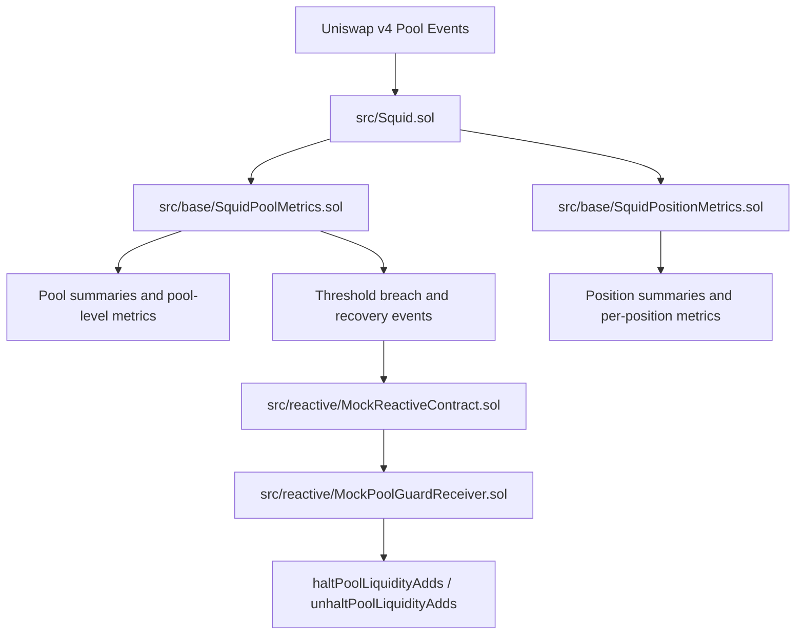
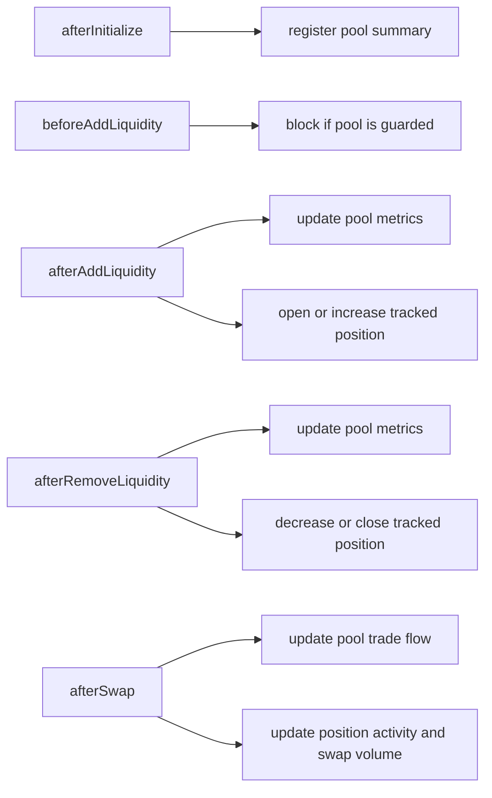
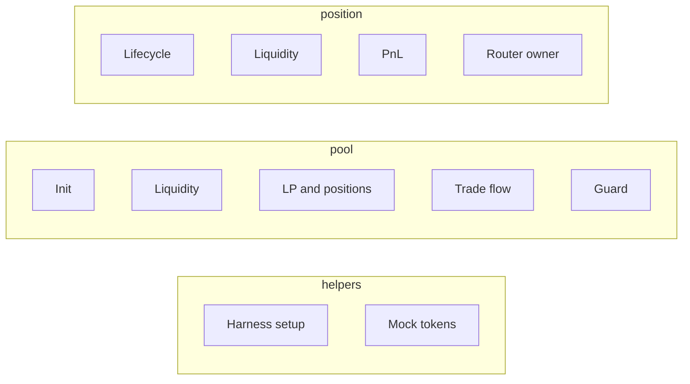
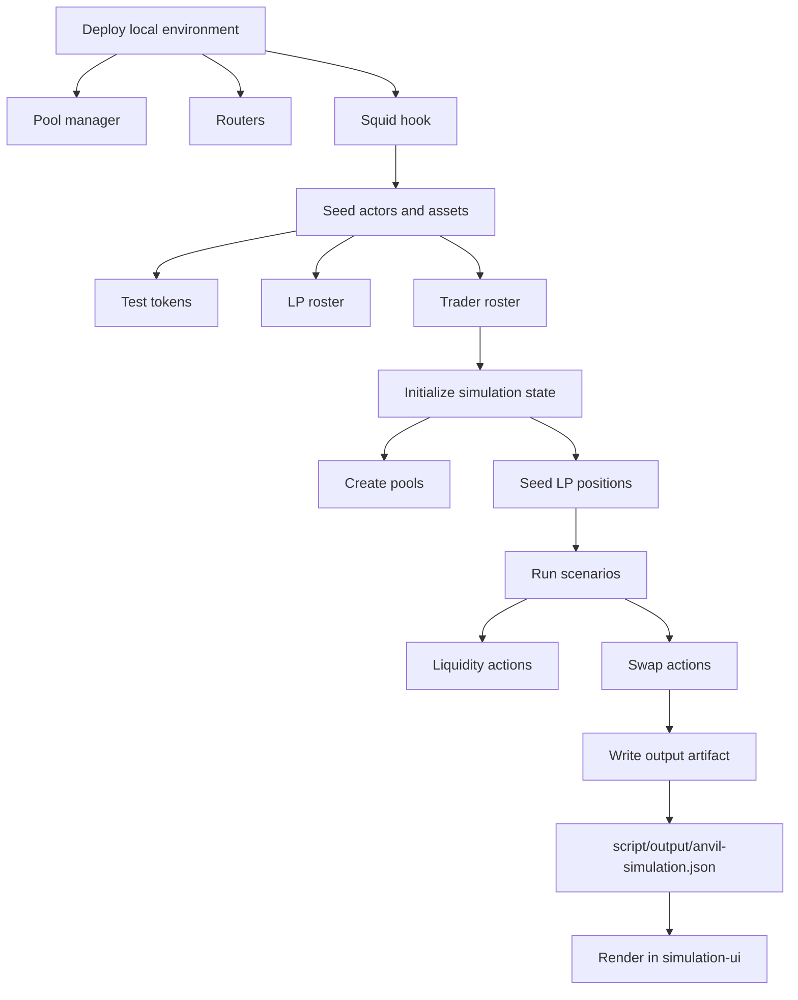

# Squid

Squid is a Uniswap v4 hook that records pool-level and position-level metrics as liquidity and swap activity flows through a pool. This repo also includes a deterministic Foundry simulation harness plus two dashboard apps for inspection.

This README is written for engineering review. It focuses on the Solidity system, the test and simulation surfaces, and the fastest path to understanding how the repo works.

## What This Repo Contains

This repo has 3 major components:

1. `./`: the root-level Foundry project containing all contracts, tests, and simulation scripts for the Squid hook
2. `./squid-ui`: a UI dashboard for passive LPs
3. `./simulation-ui`: a UI dashboard for observing liquidity and orderflow simulation output. This is still a WIP.

## Fast Review Path

If you want the shortest path to understanding the repo, review in this order:

1. [src/Squid.sol](/Users/saumay/Workspace/gh-saumay/squid/src/Squid.sol)
2. [src/base/SquidPoolMetrics.sol](/Users/saumay/Workspace/gh-saumay/squid/src/base/SquidPoolMetrics.sol)
3. [src/base/SquidPositionMetrics.sol](/Users/saumay/Workspace/gh-saumay/squid/src/base/SquidPositionMetrics.sol)
4. [test/helpers/SquidTestBase.t.sol](/Users/saumay/Workspace/gh-saumay/squid/test/helpers/SquidTestBase.t.sol)
5. [test/pool/SquidPoolInitialization.t.sol](/Users/saumay/Workspace/gh-saumay/squid/test/pool/SquidPoolInitialization.t.sol)
6. [test/pool/SquidPoolLiquidityMetrics.t.sol](/Users/saumay/Workspace/gh-saumay/squid/test/pool/SquidPoolLiquidityMetrics.t.sol)
7. [test/position/SquidPositionSummary.t.sol](/Users/saumay/Workspace/gh-saumay/squid/test/position/SquidPositionSummary.t.sol)
8. [test/position/SquidPositionPnL.t.sol](/Users/saumay/Workspace/gh-saumay/squid/test/position/SquidPositionPnL.t.sol)
9. [test/pool/SquidReactivePoolGuard.t.sol](/Users/saumay/Workspace/gh-saumay/squid/test/pool/SquidReactivePoolGuard.t.sol)
10. [script/BaseSquidSimulation.s.sol](/Users/saumay/Workspace/gh-saumay/squid/script/BaseSquidSimulation.s.sol)
11. [script/SimulateSquid.s.sol](/Users/saumay/Workspace/gh-saumay/squid/script/SimulateSquid.s.sol)

## Repository Layout

```text
.
|-- src/             Solidity contracts and types
|-- test/            Foundry tests and shared test harnesses
|-- script/          Simulation harness and generated output
|-- squid-ui/        Passive LP dashboard
`-- simulation-ui/   Simulation dashboard (WIP)
```

## System Overview



At runtime, `Squid.sol` is the hook entrypoint. It wires Uniswap v4 lifecycle callbacks into two metric systems:

- `SquidPoolMetrics`: pool registration, balances, liquidity utilization, LP counts, position counts, and trade-flow statistics
- `SquidPositionMetrics`: position identity, liquidity state, swap volume, principal tracking, fee state, and PnL

The reactive pool-guard path is a prototype integration surface built around emitted events and mocked callbacks. It is useful for review, but should not be read as production-ready automation.

### Current deployment posture

This repo is currently designed to run locally. It is not yet optimized for production deployment across supported chains.

The current implementation keeps a broad set of metrics on-chain so the system is easier to inspect, test, and iterate on. The planned optimization direction is to reduce the gas footprint by keeping only the most relevant metrics on-chain, while moving the rest of the data flow off-chain through event emission and related indexing patterns.

That optimization plan is still being refined. The current codebase should be read as a functional and inspectable baseline rather than a finalized production architecture.

### Envisioned chain strategy

The intended primary deployment target is Unichain. The reasoning is that Squid can benefit from the native DEX ecosystem there while also taking advantage of lower storage and computation costs.

The longer-term strategy is to run the fullest version of the system where the economics are most favorable, and connect leaner versions on other supported chains through Reactive Network integration.

### Reactive Network integration

The envisioned architecture is to unify the user and pool-management experience across chains by keeping relevant pool states and higher-level functionality in sync through Reactive Network.

The current local demonstration shows the shape of that pattern in a simplified form:

1. `SquidPoolMetrics` emits threshold-breach or recovery signals.
2. `MockReactiveContract` interprets those signals and prepares a callback payload.
3. `MockPoolGuardReceiver` receives the callback and calls `haltPoolLiquidityAdds` or `unhaltPoolLiquidityAdds` on `Squid`.

In production, the same idea would extend beyond a single local environment. A signal produced on one deployment could be transmitted through Reactive Network and used to coordinate corresponding pool controls or feature behavior on Squid deployments across multiple chains, so the overall product experience remains more consistent even when execution is distributed.

## Foundry Project

### Contract structure

The Solidity code under [src](/Users/saumay/Workspace/gh-saumay/squid/src) is organized by responsibility:

```text
src
|-- Squid.sol
|-- base
|   |-- SquidPoolMetrics.sol
|   `-- SquidPositionMetrics.sol
|-- libraries
|   |-- PositionLiquidityAmounts.sol
|   `-- TokenSymbolResolver.sol
|-- reactive
|   |-- MockPoolGuardReceiver.sol
|   |-- MockReactiveContract.sol
|   `-- interfaces/IReactive.sol
|-- test
|   `-- PoolModifyLiquidityTestWithMsgSender.sol
`-- types
    |-- PoolMetrics.sol
    `-- PositionMetrics.sol
```

| Path | Purpose | Why it matters |
| --- | --- | --- |
| [src/Squid.sol](/Users/saumay/Workspace/gh-saumay/squid/src/Squid.sol) | Main hook entrypoint | Defines enabled hook permissions, delegates lifecycle callbacks, and exposes pool-guard controls |
| [src/base/SquidPoolMetrics.sol](/Users/saumay/Workspace/gh-saumay/squid/src/base/SquidPoolMetrics.sol) | Pool-level accounting | Core logic for initialization, balances, liquidity utilization, LP counts, position counts, and trade-flow metrics |
| [src/base/SquidPositionMetrics.sol](/Users/saumay/Workspace/gh-saumay/squid/src/base/SquidPositionMetrics.sol) | Position-level accounting | Core logic for per-position lifecycle, liquidity, fees, principal tracking, and PnL |
| [src/types/PoolMetrics.sol](/Users/saumay/Workspace/gh-saumay/squid/src/types/PoolMetrics.sol) | Pool metric structs | Defines the shape of pool summaries and pool-level views returned by the system |
| [src/types/PositionMetrics.sol](/Users/saumay/Workspace/gh-saumay/squid/src/types/PositionMetrics.sol) | Position metric structs | Defines the shape of position summaries, liquidity snapshots, and PnL views |
| [src/libraries/PositionLiquidityAmounts.sol](/Users/saumay/Workspace/gh-saumay/squid/src/libraries/PositionLiquidityAmounts.sol) | Position amount helpers | Supports conversion between liquidity and token-amount views |
| [src/libraries/TokenSymbolResolver.sol](/Users/saumay/Workspace/gh-saumay/squid/src/libraries/TokenSymbolResolver.sol) | Token metadata helper | Handles best-effort symbol resolution during pool registration |
| [src/reactive/MockReactiveContract.sol](/Users/saumay/Workspace/gh-saumay/squid/src/reactive/MockReactiveContract.sol) | Mock reactive integration | Demonstrates how threshold-breach events could trigger a callback flow |
| [src/reactive/MockPoolGuardReceiver.sol](/Users/saumay/Workspace/gh-saumay/squid/src/reactive/MockPoolGuardReceiver.sol) | Mock guard receiver | Receives the callback and calls Squid halt and unhalt functions |
| [src/reactive/interfaces/IReactive.sol](/Users/saumay/Workspace/gh-saumay/squid/src/reactive/interfaces/IReactive.sol) | Reactive interface | Minimal interface layer for the mock integration |
| [src/test/PoolModifyLiquidityTestWithMsgSender.sol](/Users/saumay/Workspace/gh-saumay/squid/src/test/PoolModifyLiquidityTestWithMsgSender.sol) | Test-only router support | Used to validate LP ownership attribution through `IMsgSender`-aware router paths |

### Hook lifecycle



### Test structure

The test suite under [test](/Users/saumay/Workspace/gh-saumay/squid/test) is split into helpers, pool-focused tests, and position-focused tests:

```text
test
|-- helpers
|   |-- SquidTestBase.t.sol
|   `-- TestTokens.sol
|-- pool
|   |-- SquidPoolInitialization.t.sol
|   |-- SquidPoolLiquidityMetrics.t.sol
|   |-- SquidPoolLpMetrics.t.sol
|   |-- SquidPoolPositionMetrics.t.sol
|   |-- SquidPoolTradeFlowMetrics.t.sol
|   `-- SquidReactivePoolGuard.t.sol
`-- position
    |-- SquidPositionLiquidity.t.sol
    |-- SquidPositionMsgSenderRouter.t.sol
    |-- SquidPositionPnL.t.sol
    `-- SquidPositionSummary.t.sol
```

| Area | Path | Main scenarios covered |
| --- | --- | --- |
| Helpers | [test/helpers/SquidTestBase.t.sol](/Users/saumay/Workspace/gh-saumay/squid/test/helpers/SquidTestBase.t.sol) | Shared deployment harness for pool manager, hook, routers, and seeded environment |
| Helpers | [test/helpers/TestTokens.sol](/Users/saumay/Workspace/gh-saumay/squid/test/helpers/TestTokens.sol) | Mock tokens used across tests and simulations |
| Pool | [test/pool/SquidPoolInitialization.t.sol](/Users/saumay/Workspace/gh-saumay/squid/test/pool/SquidPoolInitialization.t.sol) | Pool registration, initialization metadata, symbol resolution, missing TWAP support |
| Pool | [test/pool/SquidPoolLiquidityMetrics.t.sol](/Users/saumay/Workspace/gh-saumay/squid/test/pool/SquidPoolLiquidityMetrics.t.sol) | Total liquidity, active liquidity, utilization, peak active liquidity |
| Pool | [test/pool/SquidPoolLpMetrics.t.sol](/Users/saumay/Workspace/gh-saumay/squid/test/pool/SquidPoolLpMetrics.t.sol) | Active LP count, lifetime LP count, LP retention behavior |
| Pool | [test/pool/SquidPoolPositionMetrics.t.sol](/Users/saumay/Workspace/gh-saumay/squid/test/pool/SquidPoolPositionMetrics.t.sol) | Pool-level position counts and active-position participation |
| Pool | [test/pool/SquidPoolTradeFlowMetrics.t.sol](/Users/saumay/Workspace/gh-saumay/squid/test/pool/SquidPoolTradeFlowMetrics.t.sol) | Directional swap counts and trade-flow skew |
| Pool | [test/pool/SquidReactivePoolGuard.t.sol](/Users/saumay/Workspace/gh-saumay/squid/test/pool/SquidReactivePoolGuard.t.sol) | Threshold breach and recovery events, halt transitions, blocked adds |
| Position | [test/position/SquidPositionSummary.t.sol](/Users/saumay/Workspace/gh-saumay/squid/test/position/SquidPositionSummary.t.sol) | Position identity, timestamps, salts, open/close lifecycle |
| Position | [test/position/SquidPositionLiquidity.t.sol](/Users/saumay/Workspace/gh-saumay/squid/test/position/SquidPositionLiquidity.t.sol) | Active versus total liquidity, in-range swap volume |
| Position | [test/position/SquidPositionPnL.t.sol](/Users/saumay/Workspace/gh-saumay/squid/test/position/SquidPositionPnL.t.sol) | Principal accounting, partial removal, fees, net PnL |
| Position | [test/position/SquidPositionMsgSenderRouter.t.sol](/Users/saumay/Workspace/gh-saumay/squid/test/position/SquidPositionMsgSenderRouter.t.sol) | Ownership attribution through router-based liquidity paths |

### Test coverage map



### Script structure

The simulation code under [script](/Users/saumay/Workspace/gh-saumay/squid/script) is intended to generate a reviewable artifact rather than only pass/fail output:

```text
script
|-- BaseSquidSimulation.s.sol
|-- SimulateSquid.s.sol
`-- output
    `-- anvil-simulation.json
```

| Path | Purpose | Why it matters |
| --- | --- | --- |
| [script/BaseSquidSimulation.s.sol](/Users/saumay/Workspace/gh-saumay/squid/script/BaseSquidSimulation.s.sol) | Main simulation harness | Deploys the local environment, seeds actors and pools, runs staged scenarios, and assembles output data |
| [script/SimulateSquid.s.sol](/Users/saumay/Workspace/gh-saumay/squid/script/SimulateSquid.s.sol) | Runnable entrypoint | Executes the harness and writes the JSON artifact |
| [script/output/anvil-simulation.json](/Users/saumay/Workspace/gh-saumay/squid/script/output/anvil-simulation.json) | Generated artifact | Output consumed by `simulation-ui` for visualization |

The base harness currently seeds:

- 5 pools
- 8 LP accounts
- 4 trader accounts
- multiple staged liquidity and swap actions across 5 action phases

### Simulation flow



## Setup

### 1. Foundry project

Prerequisites:

- Foundry installed
- Git installed

Install Foundry if needed:

```sh
curl -L https://foundry.paradigm.xyz | bash
foundryup
```

Clone the repo and install the required Foundry dependencies:

```sh
git clone <repo-url>
cd squid
git submodule update --init --recursive
```

This project vendors its Solidity dependencies as git submodules:

- `lib/forge-std`
- `lib/v4-hooks-public`

Build and test:

```sh
forge build
forge test
forge fmt --check
```

Run the simulation with a local Anvil node:

```sh
anvil
forge script script/SimulateSquid.s.sol:SimulateSquid --rpc-url http://127.0.0.1:8545 --sig "simulate()"
```

Offline dry run:

```sh
forge script --offline script/SimulateSquid.s.sol:SimulateSquid --sig "simulate()"
```

### 2. `squid-ui`

Prerequisites:

- Node.js installed

Install and run:

```sh
cd squid-ui
npm install
npm run dev
```

This app runs on port `3001`.

### 3. `simulation-ui`

Prerequisites:

- Node.js installed

Install and run:

```sh
cd simulation-ui
npm install
npm run dev
```

This app is still a WIP. It is intended to visualize the generated simulation artifact at [script/output/anvil-simulation.json](/Users/saumay/Workspace/gh-saumay/squid/script/output/anvil-simulation.json).

## External Dependencies

- Uniswap v4 core and periphery via the `lib/v4-hooks-public` submodule
- Foundry standard library via the `lib/forge-std` submodule
- Next.js, React, and related frontend dependencies for the dashboard apps

Remappings and simulation output filesystem permissions are defined in [foundry.toml](/Users/saumay/Workspace/gh-saumay/squid/foundry.toml).

## Known Limitations

- `simulation-ui` is still a work in progress.
- The reactive pool-guard path is mock-based and should not be read as production-ready automation.
- TWAP access is not implemented; `getTwapSqrtPriceX96` explicitly reverts.
- The repo is currently optimized for metrics capture, testing, and reviewability rather than a finalized deployment model.
